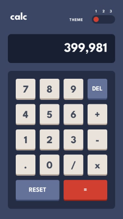
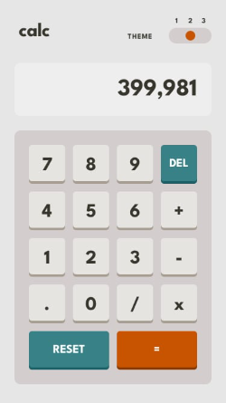
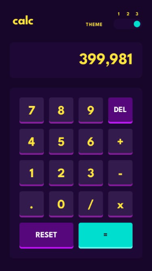

# Calculadora MultiLayout

## Funcionalidades

* 🛠️ Executa as operações básicas
    > Soma
  
    > Subtração
  
    > Divisão
  
    > Multiplicação
  
* 🛠️ Armazena a memória de contas anteriores
* 🛠️ Executa contas em sequência
* 🛠️ Opção de apagar um número da tela
* 🛠️ Opção de resetar a memória
* 🛠️ Opção de escolher entre os 3 possíveis layouts
* 🛠️ Exibição dinâmica para diferentes tipos de tela

## Layouts

## Considerações Finais
  > Esse foi um projeto o qual reforçou plenamente meus conhecimentos nas funcionalidades do JavaScript, onde tentei ao máximo adicionar funcionalidades e validações para evitar bugs.
  
## Autor

Pedro Lessa